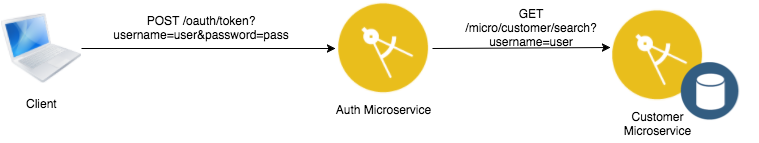
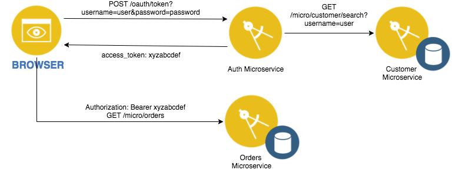

# Secure REST API with OAuth 2.0 and Authorization Service

*This project is part of the 'IBM Cloud Native Reference Architecture' suite, available at
https://github.com/ibm-cloud-architecture/refarch-cloudnative-kubernetes*

This project demonstrates how to authenticate the API user as well as enable OAuth 2.0 authorization for all OAuth protected APIs in the BlueCompute reference application. The Spring Authorization Server is used as an OAuth provider; the BlueCompute reference application delegates authentication and authorization to this component, which verifies credentials using the [Customer Microservice](https://github.com/ibm-cloud-architecture/refarch-cloudnative-micro-customer). The project contains the following components:

 - Spring-based Authorization Server application that handles user authentication and authorization
 - Uses Spring Feign Client to call Customer Microservice to validate login credentials
 - Return a signed [JWT](https://jwt.io) Bearer token back to caller for identity propagation and authorization

## Use Case

### Interaction with Identity Provider (Customer Microservice)



The Authorization microservice leverages the [Customer Microservice](https://github.com/ibm-cloud-architecture/refarch-cloudnative-micro-customer) as an identity provider.  
- When username/password is passed in, the Authorization microservice calls the Customer microservice using Spring Feign Client.  
- Authorization microservice checks the password against the password returned by the Customer API.  If it matches, `HTTP 200` is returned to indicate that the username/password are valid, `HTTP 401` is returned to indicate that the username/password is invalid.

  *Note that this is only meant as a demonstration on how to implement a custom identity provider and shouldn't be used in production, as the passwords are returned in compared in plaintext instead of using secure one-way hashes.*

### Interaction with Resource Server API 



- When a client wishes to acquire an OAuth token to call a protected API, it calls the OAuth Provider (Authorization microservice) token endpoint with the username/password of the user and requests a token with scope `blue`.
- Authorization microservice will call the Customer microservice to get the Customer object assicated with the username/password and perform the validation.
- If the username/password are valid, `HTTP 200` is returned, along with a JWT (signed using a HS256 shared secret) in the JSON response under `access_token` which contains the customer ID of the user passed in in the `user_name` claim.
- The client uses the JWT in the `Authorization` header as a bearer token to call other Resource Servers that have OAuth protected API (such as the [Orders microservice](https://github.com/ibm-cloud-architecture/refarch-cloudnative-micro-orders)).
- The service implementing the REST API verifies that the JWT is valid and signed using the shared secret, then extracts the `user_name` claim from the JWT to identify the caller.
- The JWT is encoded with scope `blue` and the the expiry time in `exp`; once the token is generated there is no additional interaction between the Resource Server and the OAuth server.

## REST API Endpoints

Following the [OAuth 2.0 specification](https://tools.ietf.org/html/rfc6749), the Authorization server exposes both an authorization URI and a token URI.

- GET `/oauth/authorize`
- POST `/oauth/token`

The BlueCompute reference application supports the following clients and grant types:

- The [BlueCompute Web Application](https://github.com/ibm-cloud-architecture/refarch-cloudnative-bluecompute-web) using client ID `bluecomputeweb` and client secret `bluecomputewebs3cret` supports OAuth 2.0 Password grant type.
- The [BlueCompute Mobile Application](https://github.com/ibm-cloud-architecture/refarch-cloudnative-bluecompute-mobile) using client ID `bluecomputemobile` and client secret `bluecomputemobiles3cret` supports OAuth 2.0 Implicit grant type.

The BlueCompute application has one scope, `blue`.

## Pre-requisites

### Install Docker

Install [Docker](https://www.docker.com)

### Install Bluemix CLI and IBM Container Service plugins

Install the [bx CLI](https://clis.ng.bluemix.net/ui/home.html), the Bluemix container-registry Plugin and the Bluemix container-service plugin.  The plugins can be installed directly [here](http://plugins.ng.bluemix.net/ui/repository.html), or using the following commands:

```
# bx plugin install container-service -r Bluemix
# bx plugin install conatiner-registry -r Bluemix
```

### Install kubectl

Install the [kubectl CLI](https://kubernetes.io/docs/tasks/kubectl/install/).

### Create HS256 shared secret

The *same* HS256 shared secret used to sign the generated JWT is needed by all resource servers to validate the access token provided by the caller.

A 2048-bit secret can be generated using the following command:

```
# cat /dev/urandom | env LC_CTYPE=C tr -dc 'a-zA-Z0-9' | fold -w 256 | head -n 1 | xargs echo -n
```

## Build and execute the code locally

1. Build the application.

   ```
   # ./gradlew build
   ```

2. Deploy the Customer microservice dependency.

   The Authorization microservice has a dependency on the [Customer microservice](https://github.com/ibm-cloud-architecture/refarch-cloudnative-micro-customer).  Build and deploy a local Customer microservice instance.  Create a customer with username `foo` and password `bar`.

3. Run the application

   Assuming Customer microservice is listening on local port 8080, execute the following in a different terminal to run the Authorization microservice on port 8000.  Ensure that the `HS256 Shared Secret` is replaced in the command.

   ```
   java \
    -Djwt.sharedSecret=<HS256 Shared Secret> \
    -DcustomerService.url=http://localhost:8080 \
    -Dserver.port=8000 \
    -jar build/libs/micro-auth-0.1.0.jar
   ```

4. Validate the password flow of the authorization service

   The [Web Application](https://github.com/ibm-cloud-architecture/refarch-cloudnative-bluecompute-web) uses the password flow to obtain a password token.  It uses Client ID `bluecomputeweb` and Client Secret `bluecomputewebs3cret`.  For a user `foo` with password `bar`, run the following to obtain an access token with scope `blue`:

   ```
   # curl -i \
       -X POST \
       -u bluecomputeweb:bluecomputewebs3cret \
       http://localhost:8000/oauth/token?grant_type=password\&username=foo\&password=bar\&scope=blue
   ```
   
   The response JSON returned will contain an `access_token`.  Use the debugger at [jwt.io](https://jwt.io) to decode the token and validate the signature by pasting the `access_token` into the `Encoded` text field, and pasting the HS256 shared secret in the `Verify Signature` text box.  You should observe the `client_id` and `scope` claims in the payload correspond to the client ID and scope passed in on the request query, the `user_name` corresponds to the customer ID of `foo` returned from the Customer Service, and the signature is verified.
   
5. Validate the implicit flow of the authorization service

   The [Mobile application](https://github.com/ibm-cloud-architecture/refarch-cloudnative-bluecompute-mobile) uses the implicit flow to create a token by opening a browser and retrieving the OAuth token once the authorization flow is complete.  
   
   To validate that this works, open a browser window and navigate to the following URL.  This requests the token with scope `blue` using the client id `bluecomputemobile` with the client secret `bluecomputemobiles3cret`.  When the full authorization flow is completed, the authorization server will redirect the browser to `http://localhost:8000`.
   
   ```
   http://localhost:8000/oauth/authorize?client_id=bluecomputemobile&client_secret=bluecomputemobiles3cret&response_type=token&redirect_uri=http://localhost:8000
   ```
   
   The login form is shown with the username and password.  Enter the username and password `foo` and `bar` respectively, and the browser is taken to the authorization page.  When authorization is granted, the browser is taken to the URL with the access token as a query parameter.
   
   As with the password flow, you can use [jwt.io](https://jwt.io) to verify the token's scope and claims.

## Deploy the Service to Bluemix

### Bulid the Docker container image
   
```
# ./gradlew docker
# cd docker
# docker build -t auth-microservice .
```

### Push the Docker container image to the Bluemix private registry

1. Log into the Bluemix CLI

   ```
   # bx login
   ```
   
   Be sure to set the correct target space.
   
2. Initialize the Bluemix Container Service plugin
   
   ```
   # bx cs init
   ```
   
   Initialize the Bluemix Container Registry plugin:
   
   ```
   # bx cr login
   ```
   
   Get the registry namespace:
   
   ```
   # bx cr namespaces
   ```
   
   If there are no namespaces available, use the following command to create one:
   
   ```
   # bx cr namespace-add <namespace>
   ```
   
3. Tag and push the docker image to the Bluemix private registry:

   ```
   # docker tag auth-microservice registry.ng.bluemix.net/<namespace>/auth-microservice
   # docker push registry.ng.bluemix.net/<namespace>/auth-microservice
   ```

### Create a Kubernetes Cluster (if applicable)
   
If a Kubernetes cluster has not previously been created, create a free Kubernetes cluster using the following:
   
```
# bx cs cluster-create --name <cluster_name>
```
   
You can monitor the cluster creation using `bx cs clusters` and `bx cs workers <cluster_name>`. 
   
### Set up kubectl

Once the cluster has been created, download the configuration:
   
```
# bx cs cluster-config <cluster_name>
```
   
Cut and paste the `export KUBECONFIG` command to set up the kubectl CLI to talk to the Kubernetes instance.
   
### Create a secret for the HS256 shared key

Create a secret for the HS256 shared key in the Kubernetes cluster.
   
```
# kubectl create secret generic hs256-key --from-literal=key=<HS256-key>
```

### Deploy the Customer Microservice to the same Kubernetes Cluster

Follow the deployment instructions for the [Customer microservice](https://github.com/ibm-cloud-architecture/refarch-cloudnative-micro-customer) and deploy it to the same Kubernetes cluster.  The authorization service by default calls the Customer microservice using the REST-API exposed internally to the Kubernetes cluster as a local service named `customer-service` listening on port `8080`.
   
### Update the deployment yaml for the Authorization microservice:
   
Open and editor and update the yaml:
   
```
# vi kubernetes/auth.yaml
```
   
1. Update the the path under `spec.template.spec.containers[0].image` to correspond to the image pushed to the registry (in step 3).
2. Update the secret name under `spec.template.spec.volumes.name.secret[0].secretName` to correspond to the name of the Kubernetes secret for the HS256 shared secret (e.g. `hs256-key` by default).
   
Here is an example of what the updated deployment may look like:
   
```
---
apiVersion: extensions/v1beta1
kind: Deployment
metadata:
  name: auth-microservice
spec:
  replicas: 2
  template:
    metadata:
      labels:
        app: bluecompute
        tier: frontend
        micro: auth
    spec:
      containers:
      - name: auth-service
        image: registry.ng.bluemix.net/myimages/auth-microservice
        imagePullPolicy: Always
        volumeMounts:
        - mountPath: /opt/hs256-key
          name: hs256-key
        ports:
        - containerPort: 8080
      volumes:
      - name: hs256-key
        secret:
          defaultMode: 420
          secretName: hs256-key

```
      
### Deploy to Bluemix

Deploy the pods.
   
```
# kubectl create -f kubernetes/auth.yaml
```

Also deploy the service
   
```
# kubectl create -f kubernetes/auth-service.yaml
```

Since the Authorization microservice is exposed directly to the internet, create an Ingress resource to expose the `/oauth/token` and `/oauth/authorize` endpoints:

```
# kubectl create -f kubernetes/auth-ingress.yaml
```

The authorization service token endpoint is now available for clients at `http://<cluster_name>.<region>.containers.mybluemix.net/oauth/authorize` and `http://<cluster_name>.<region>.containers.mybluemix.net/oauth/token`.
